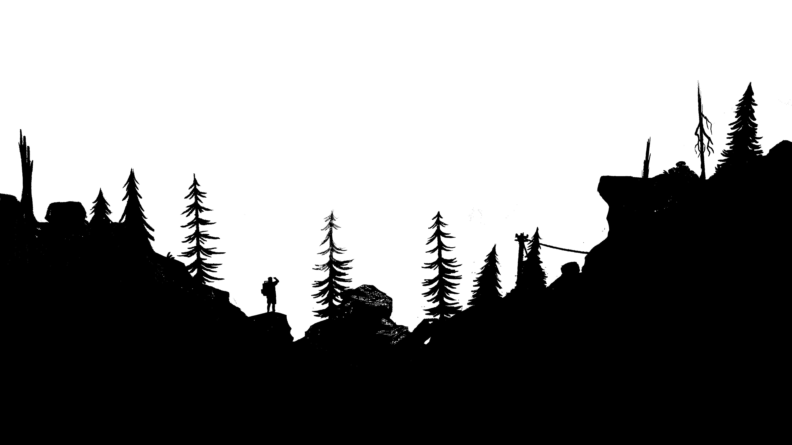
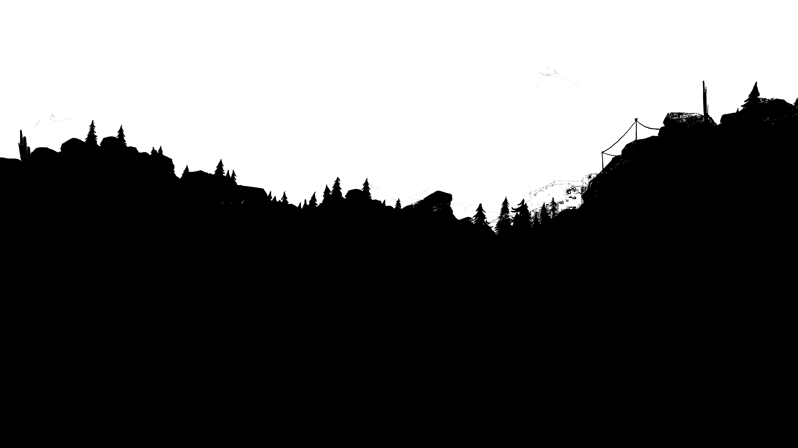
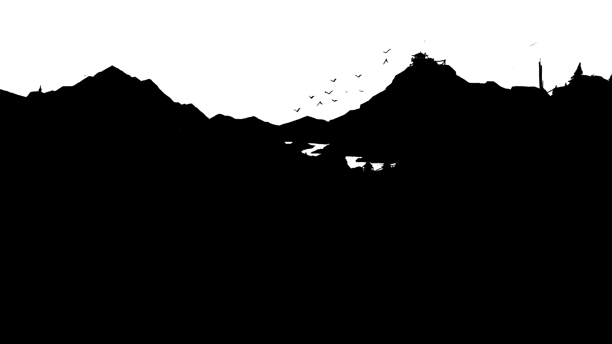
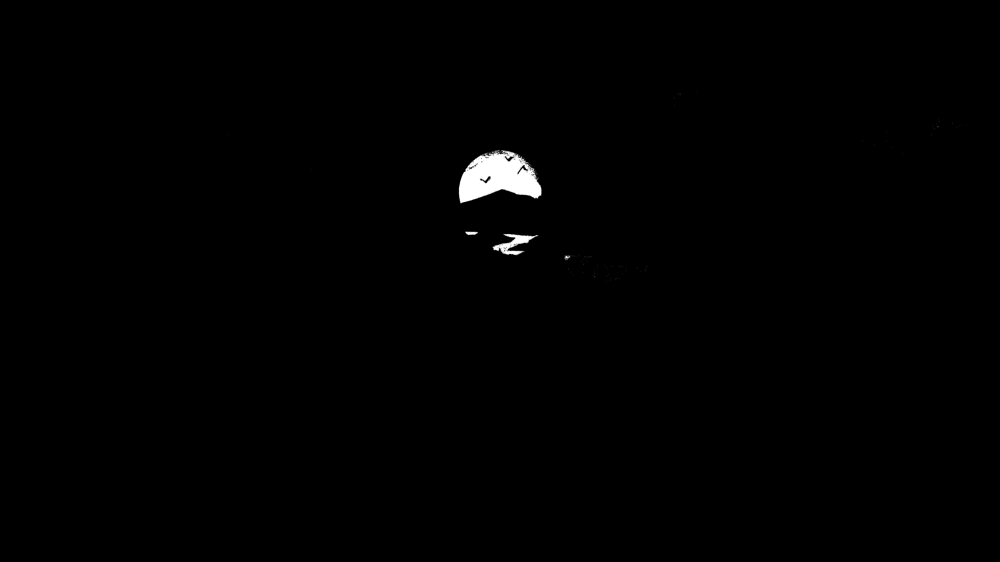
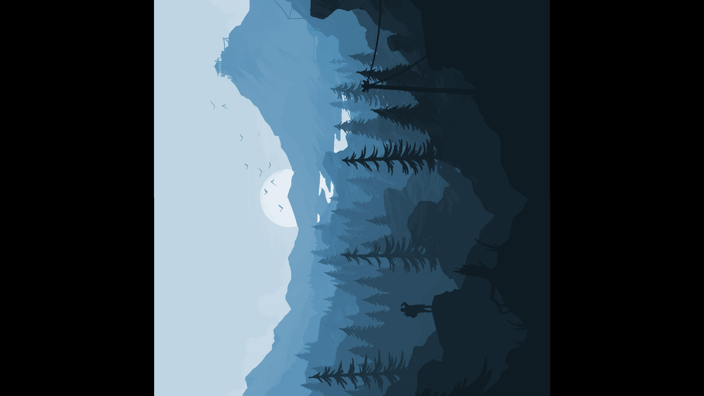
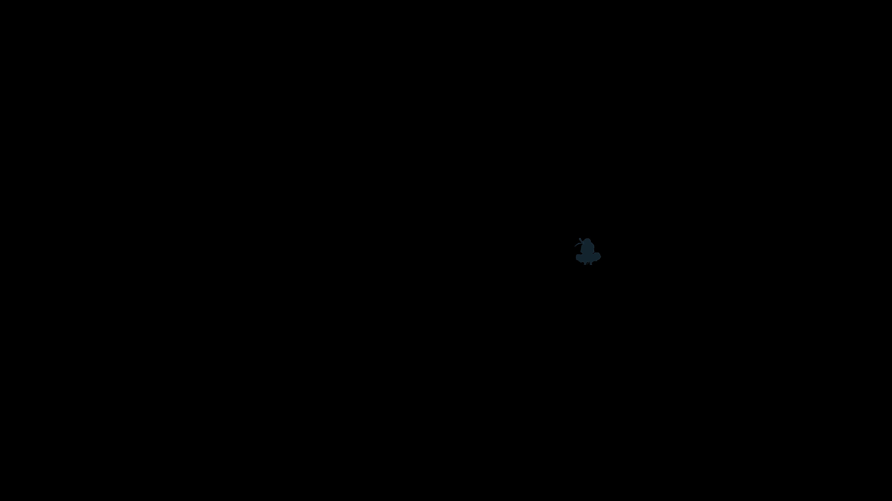

# Tugas Operasi-operasi Citra

Anggota:
- Defrian Afandi (09021281722075)
- Farhan Furqan (09021281722045)
- M Imam Pratama (09021281722063)

Semua source code dan gambar di bawah dapat dilihat di link berikut:
http://bit.ly/operasicitra

## Dasar Pengoperasian Citra pada Python 3

Untuk implementasi operasi-operasi citra pada program, kami menggunakan bahasa
pemrograman Python 3 dan library PIL (Python Image Library) pada python.

untuk menginstall library-nya, jalankan command berikut:

```
pip3 install pillow
```

Untuk menggunakannya pada program python, masukkan snippet berikut pada bagian
atas program

```python
from PIL import Image
```

Sebelum melakukan operasi terhadap citra digital, kita harus mengaksesnya dulu
seperti berikut:

```python
CITRA = Image.open('gambar.jpg')
PIXEL = CITRA.load()
```

Untuk mengetahui ukuran gambar yang akan kita olah, gunakan variable `size`
seperti berikut:

```python
print(CITRA.size)
print(CITRA.size[0])  # ukuran horizontal
print(CITRA.size[1])  # ukuran vertikal
```

Berikut contoh outputnya:

```
(5120, 2880)
5120
2880
```

Untuk mengkonversi suatu citra RGB ke grayscale, berikut caranya:

```python
# sumber: https://stackoverflow.com/a/18778280/9157799
CITRA_GRAYSCALE = Image.open('gambar.jpg').convert('L')
```

Jika kita telah selesai melakukan operasi-operasi terhadap suatu citra, kita
perlu menyimpan hasil pengolahan citranya dengan cara berikut:

```python
CITRA_GRAYSCALE.save('gambar_grayscale.jpg')
```

## Operasi pada aras titik

Berikut cara mengakses pixel dan nilai RGB dari suatu citra:

```python
x = 3
y = 8
print(PIXEL[x, y])   # nilai RGB dari pixel (x, y)
print(PIXEL[x, y][0])  # nilai R dari pixel (x, y)
print(PIXEL[x, y][1])  # nilai G dari pixel (x, y)
print(PIXEL[x, y][2])  # nilai B dari pixel (x, y)
```

Dan berikut cara mengubah RGB dari suatu pixel:

```python
PIXEL[3, 8] = (0, 0, 0)  # mengubah pixel (3, 8) menjadi warna hitam
```

Untuk citra grayscale, berikut caranya:

```python
# jangan lupa akses pixel dari citra grayscale
PIXEL_GRAYSCALE = CITRA_GRAYSCALE.load()

PIXEL_GRAYSCALE[3, 8] = 128
print(PIXEL_GRAYSCALE[3, 8])
```

### Citra Biner

untuk membuat citra biner, kita menggunakan citra grayscale. Berikut programnya:

```python
from PIL import Image

# fungsi citra biner
def citra_biner(nilai_ambang):
    # konversi gambar RGB ke grayscale
    # https://stackoverflow.com/a/18778280/9157799
    CITRA_GRAYSCALE = Image.open('gambar.jpg').convert('L')
    PIXEL_GRAYSCALE = CITRA_GRAYSCALE.load()

    ukuran_horizontal = CITRA_GRAYSCALE.size[0]
    ukuran_vertikal = CITRA_GRAYSCALE.size[1]

    for x in range(ukuran_horizontal):
        for y in range(ukuran_vertikal):
            if PIXEL_GRAYSCALE[x, y] < nilai_ambang:
                PIXEL_GRAYSCALE[x, y] = 0
            else:
                PIXEL_GRAYSCALE[x, y] = 255

    nama_setelah_disave = 'gambar_biner_' + str(nilai_ambang) + '.jpg'
    CITRA_GRAYSCALE.save(nama_setelah_disave)


citra_biner(50)
citra_biner(128)
citra_biner(200)
citra_biner(230)
```

Berikut gambar asli sebelum diolah:


Setelah dilakukan operasi citra biner dengan batas ambang 50:


Setelah dilakukan operasi citra biner dengan batas ambang 128:


Setelah dilakukan operasi citra biner dengan batas ambang 200:


Setelah dilakukan operasi citra biner dengan batas ambang 230:


### Citra Negatif

untuk membuat citra negatif, berikut programnya:

```python
from PIL import Image

CITRA = Image.open('gambar.jpg')

ukuran_horizontal = CITRA.size[0]
ukuran_vertikal = CITRA.size[1]

PIXEL = CITRA.load()

for x in range(ukuran_horizontal):
    for y in range(ukuran_vertikal):
        R = 255 - PIXEL[x, y][0]
        G = 255 - PIXEL[x, y][1]
        B = 255 - PIXEL[x, y][2]
        PIXEL[x, y] = (R, G, B)

CITRA.save('gambar_negatif.jpg')
```

Masih menggunakan gambar yang sama, berikut hasil gambar setelah dilakukan operasi citra negatif:


### Pencerahan Citra

untuk operasi pencerahan citra, berikut programnya:

```python
from PIL import Image

def clipping(intensitas):
    if intensitas < 0:
        return 0
    if intensitas > 255:
        return 255
    return intensitas

def atur_pencerahan(nilai_pencerahan, nama_setelah_disave):
    CITRA = Image.open('gambar.jpg')
    PIXEL = CITRA.load()

    ukuran_horizontal = CITRA.size[0]
    ukuran_vertikal = CITRA.size[1]

    for x in range(ukuran_horizontal):
        for y in range(ukuran_vertikal):
            R = clipping(PIXEL[x, y][0] + nilai_pencerahan)
            G = clipping(PIXEL[x, y][1] + nilai_pencerahan)
            B = clipping(PIXEL[x, y][2] + nilai_pencerahan)
            PIXEL[x, y] = (R, G, B)

    CITRA.save(nama_setelah_disave)


atur_pencerahan(80, 'gambar_dicerahkan.jpg')
atur_pencerahan(-80, 'gambar_digelapkan.jpg')
```

Gambar yang sama, berikut hasil gambar setelah dilakukan operasi pencerahan citra;

Dengan intensitas +80:


Dengan intensitas -80:


## Operasi Geometri

### Rotasi Citra

Berikut implementasi rotasi citra dalam python:

```python
from PIL import Image
from math import sin, cos


def rotasi(derajat):
    CITRA = Image.open('gambar.jpg')
    PIXEL = CITRA.load()

    ukuran_horizontal = CITRA.size[0]
    ukuran_vertikal = CITRA.size[1]

    CITRA_BARU = Image.new("RGB", (ukuran_horizontal, ukuran_vertikal))
    PIXEL_BARU = CITRA_BARU.load()

    x_tengah = ukuran_horizontal // 2
    y_tengah = ukuran_vertikal // 2

    for x in range(ukuran_horizontal):
        for y in range(ukuran_vertikal):
            # theta == radian
            theta = derajat * 22/7 / 180

            # rumus rotasi dengan pusat rotasi bebas (disini tengah)
            # sumber: https://homepages.inf.ed.ac.uk/rbf/HIPR2/rotate.htm
            x_baru = (cos(theta) * (x - x_tengah) - sin(theta)
                      * (y - y_tengah) + x_tengah)
            y_baru = (sin(theta) * (x - x_tengah) + cos(theta)
                      * (y - y_tengah) + y_tengah)

            # rumus rotasi dengan pusat rotasi (0, 0)
            # dari buku rinaldi munir
            # x_baru = x*cos(theta) - y*sin(theta)
            # y_baru = x*cos(theta) + y*cos(theta)

            if (x_baru >= ukuran_horizontal or y_baru >= ukuran_vertikal
                    or x_baru < 0 or y_baru < 0):
                PIXEL_BARU[x, y] = (0, 0, 0)
            else:
                PIXEL_BARU[x, y] = PIXEL[x_baru, y_baru]

    nama_setelah_disave = 'gambar_rotasi_' + str(derajat) + '.jpg'
    CITRA_BARU.save(nama_setelah_disave)


rotasi(45)
rotasi(90)
rotasi(180)
```

Berikut hasil setelah di Rotasi 45°:


Berikut hasil setelah di Rotasi 90°:


Berikut hasil setelah di Rotasi 180°:


### Translasi Citra

Berikut implementasi translasi citra dalam python:

```python
from PIL import Image
def translasi(m, n):
    CITRA = Image.open('gambar.jpg')
    PIXEL = CITRA.load()

    ukuran_horizontal = CITRA.size[0]
    ukuran_vertikal = CITRA.size[1]

    CITRA_BARU = Image.new("RGB", (ukuran_horizontal, ukuran_vertikal))
    PIXEL_BARU = CITRA_BARU.load()

    start_m = m
    start_n = n

    if m < 0:
        start_m = 0
    if n < 0:
        start_n = 0

    for x in range(start_m, ukuran_horizontal):
        for y in range(start_n, ukuran_vertikal):
            x_baru = x - m
            y_baru = y - n
       
            if (x_baru >= ukuran_horizontal or y_baru >= ukuran_vertikal or x_baru < 0 or y_baru < 0):
                PIXEL_BARU[x, y] = (0, 0, 0)
            else:
                PIXEL_BARU[x, y]= PIXEL[x_baru, y_baru]

    nama_setelah_disave = 'gambar_translasi_' + str(m) + '_' + str(n) +'.jpg'
    CITRA_BARU.save(nama_setelah_disave)

translasi(200, 500)
translasi(-200, -500)
```

Berikut hasil translasi(200, 500):


Berikut hasil translasi(-200, -500):


### Dilatasi Citra

Berikut implementasi dilatasi citra dalam python:

```python
from PIL import Image
from math import floor

def skala(s):
    CITRA = Image.open('gambar2.jpg')
    PIXEL = CITRA.load()

    ukuran_horizontal = CITRA.size[0]
    ukuran_vertikal = CITRA.size[1]

    ukuran_horizontal_baru = floor(ukuran_horizontal * s)
    ukuran_vertikal_baru = floor(ukuran_vertikal * s)
    
    CITRA_BARU = Image.new("RGB", (ukuran_horizontal_baru, ukuran_vertikal_baru))
    PIXEL_BARU = CITRA_BARU.load()

    for x in range(ukuran_horizontal_baru):
        for y in range(ukuran_vertikal_baru):
            x_lama = ukuran_horizontal * x / ukuran_horizontal_baru
            y_lama = ukuran_vertikal * y / ukuran_vertikal_baru
            PIXEL_BARU[x, y] = PIXEL[x_lama, y_lama]

    nama_setelah_disave = 'gambar_dilatasi_skala_' + str(s).replace('.', ',') + '.jpg'
    CITRA_BARU.save(nama_setelah_disave)

skala(0.7)
skala(1.6)
```
Berikut Gambar asli:


Hasil dilatasi dengan skala 0,7:


Hasil dilatasi dengan skala 1,6:


### Flipping Citra 

Berikut implementasi flipping citra dalam python:

```python
from PIL import Image

def flipping_vertikal(gambar, nama_setelah_disave):
    CITRA = Image.open(gambar)
    PIXEL = CITRA.load()

    ukuran_horizontal = CITRA.size[0]
    ukuran_vertikal = CITRA.size[1]

    CITRA_BARU = Image.new("RGB", (ukuran_horizontal, ukuran_vertikal))
    PIXEL_BARU = CITRA_BARU.load()

    for x in range(ukuran_horizontal):
        for y in range(ukuran_vertikal):
            PIXEL_BARU[x, y] = PIXEL[x, ukuran_vertikal - 1 - y]

    CITRA_BARU.save(nama_setelah_disave)

def flipping_horizontal(gambar, nama_setelah_disave):
    CITRA = Image.open(gambar)
    PIXEL = CITRA.load()

    ukuran_horizontal = CITRA.size[0]
    ukuran_vertikal = CITRA.size[1]

    CITRA_BARU = Image.new("RGB", (ukuran_horizontal, ukuran_vertikal))
    PIXEL_BARU = CITRA_BARU.load()

    for x in range(ukuran_horizontal):
        for y in range(ukuran_vertikal):
            PIXEL_BARU[x, y] = PIXEL[ukuran_horizontal - 1 - x, y]

    CITRA_BARU.save(nama_setelah_disave)

def flipping_titik_asal(gambar, nama_setelah_disave):
    CITRA = Image.open(gambar)
    PIXEL = CITRA.load()

    ukuran_horizontal = CITRA.size[0]
    ukuran_vertikal = CITRA.size[1]

    CITRA_BARU = Image.new("RGB", (ukuran_horizontal, ukuran_vertikal))
    PIXEL_BARU = CITRA_BARU.load()

    for x in range(ukuran_horizontal):
        for y in range(ukuran_vertikal):
            PIXEL_BARU[x, y] = PIXEL[ukuran_horizontal - 1 - x, ukuran_vertikal -1 -y]

    CITRA_BARU.save(nama_setelah_disave)

flipping_vertikal('gambar.jpg', 'gambar_flip_vertikal.jpg')
flipping_horizontal('gambar.jpg', 'gambar_flip_horizontal.jpg')
flipping_titik_asal('gambar.jpg', 'gambar_flip_titik_asal.jpg')
```

Berikut Gambar asli:


Hasil flipping citra secara vertikal:


Hasil flipping citra secara forizontal:


Hasil flipping citra secara titik asal:


## Operasi Aritmetika

### Pengurangan Dua Citra

Berikut penerapan operasi pengurangan dua citra untuk mendapatkan perbedaan
dari dua gambar yang berbeda:

```python
from PIL import Image

def pengurangan_dua_citra(citra_A, citra_B, citra_hasil):
    # pastikan ukuran citra A dan citra B sama :)
    CITRA_A = Image.open(citra_A)
    PIXEL_A = CITRA_A.load()

    CITRA_B = Image.open(citra_B)
    PIXEL_B = CITRA_B.load()

    ukuran_horizontal = CITRA_A.size[0]
    ukuran_vertikal = CITRA_A.size[1]

    CITRA_HASIL = Image.new("RGB", (ukuran_horizontal, ukuran_vertikal))
    PIXEL_HASIL = CITRA_HASIL.load()

    for x in range(ukuran_horizontal):
        for y in range(ukuran_vertikal):
            R = PIXEL_A[x, y][0] - PIXEL_B[x, y][0]
            G = PIXEL_A[x, y][1] - PIXEL_B[x, y][1]
            B = PIXEL_A[x, y][2] - PIXEL_B[x, y][2]
            PIXEL_HASIL[x, y] = (R, G, B)

            # jika terdapat perbedaan antara pixel A dan pixel B,
            # gunakan pixel B
            if R > 0 or G > 0 or B > 0:
                PIXEL_HASIL[x, y] = PIXEL_B[x, y]

    CITRA_HASIL.save(citra_hasil)


pengurangan_dua_citra('gambar.jpg', 'gambar_berbeda.png',
                      'gambar_perbedaan.jpg')
```

Masih menggunakan gambar tadi:


dilakukan operasi pengurangan dengan gambar yang berbeda:


didapat hasil perbedaannya berikut ini:


